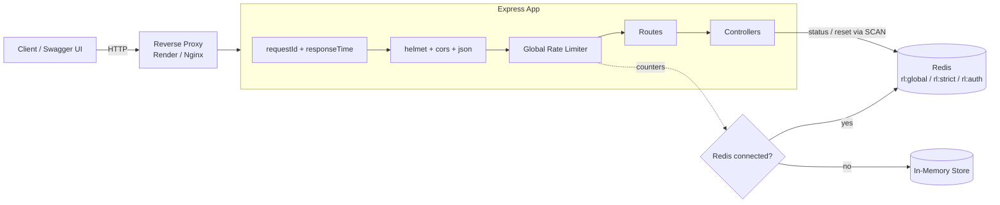

# Rate Limiter API — Step-by-Step Build Guide

> **Archived: original build playbook.** This document is the original roadmap used to build the Rate Limiter API from an empty folder to a deployed service. The codebase may have evolved since this guide was written, so treat it as a making-of narrative rather than a live specification. For current setup, architecture, and deployment notes, see [../README.md](../README.md).

---

> **Project Summary:** Rate Limiter API is a distributed API abuse-prevention service built on Express 5. It exposes demo resource and authentication endpoints guarded by three independent rate limiting tiers (global, strict, and auth), each with its own window and threshold. Counters are stored in Redis (via `ioredis` + `rate-limit-redis`) for consistent limiting across multiple instances, with automatic fallback to an in-memory store when Redis is unavailable. The service ships with Helmet security headers, CORS, request tracing (`X-Request-Id`), response timing (`X-Response-Time`), RFC draft-7 rate limit headers, graceful shutdown, an interactive Swagger UI, and a Render blueprint for one-click deployment.

Each step below is a self-contained prompt. Execute them in order.

Stack: Node.js (18+), Express 5, ioredis, express-rate-limit, rate-limit-redis, Helmet, CORS, dotenv, swagger-jsdoc, swagger-ui-express, nodemon, Render.

---

## Table of Contents

**PHASE 1 — Backend Foundation**

- STEP 1 — Project Scaffolding & Dependency Setup
- STEP 2 — Environment Configuration Loader
- STEP 3 — Redis Client with Retry & Fallback

**PHASE 2 — Cross-Cutting Middleware**

- STEP 4 — Request ID & Response Time Middleware
- STEP 5 — Rate Limiter Factory (Redis / Memory)
- STEP 6 — Global Error Handler

**PHASE 3 — API Layer**

- STEP 7 — Controllers (Resources, Auth, Rate Limit Management)
- STEP 8 — Health Controller
- STEP 9 — Routes with Swagger JSDoc
- STEP 10 — Swagger / OpenAPI Specification

**PHASE 4 — App Assembly**

- STEP 11 — Express App Composition
- STEP 12 — Server Entry Point & Graceful Shutdown

**PHASE 5 — Polish & Deploy**

- STEP 13 — Documentation (README & .env.example)
- STEP 14 — Render Blueprint & Deployment
- STEP 15 — GitHub Community Health Files

**Appendices**

- Appendix A — Shared Constants & Environment Variables
- Appendix B — Common Pitfalls
- Appendix C — Pre-Flight Checklist

---

## Global Build Rules (apply to EVERY step)

- **No git operations.** Do not run `git` commands, do not commit, and do not push. Version control is handled manually by the user.
- Do not install unapproved packages. Only add the dependencies listed in STEP 1 (or explicitly required by a later step).
- Do not run long-running processes (dev servers, watchers) unless explicitly requested.
- Treat every step as self-contained: it states its goal, the files it touches, and an acceptance check.
- Use modern JavaScript (ES6+, `async/await`), CommonJS modules, descriptive `camelCase` names, and keep code DRY and reusable.
- Prioritize security (Helmet, no leaked secrets), performance (non-blocking Redis access), and clear, minimal output.

---

## Architecture at a Glance



The client (or Swagger UI) reaches the Express app, optionally through a reverse proxy. Every request is tagged with a request ID and timed, secured by Helmet/CORS, then passed through the global rate limiter. Route-specific limiters (strict, auth) wrap individual endpoints. Rate limit counters live in Redis when connected (enabling distributed limiting) and fall back to an in-memory store otherwise. Management endpoints read and reset counters using the non-blocking `SCAN` command.

---

# PHASE 1 — BACKEND FOUNDATION

---

## STEP 1 — Project Scaffolding & Dependency Setup

**Goal:** Initialize the Node.js project, define scripts, and install the runtime and dev dependencies.

**Files to create/edit:**

- `package.json`
- `.gitignore`

**Dependencies:**

```bash
npm install cors dotenv express express-rate-limit helmet ioredis rate-limit-redis swagger-jsdoc swagger-ui-express
npm install --save-dev nodemon
```

**Implementation notes:**

- Set `"type": "commonjs"` and `"main": "src/server.js"`.
- Scripts: `"start": "node src/server.js"` and `"dev": "nodemon src/server.js"`.
- `.gitignore` must exclude `node_modules/`, all `.env*` secret variants (keep `.env.example` tracked), logs, OS files, IDE folders, and build/coverage output.

**Acceptance:** `npm install` completes; `package.json` lists all dependencies above; `.gitignore` ignores `node_modules/` and `.env`.

---

## STEP 2 — Environment Configuration Loader

**Goal:** Centralize all environment access in a single typed config object so the rest of the app never touches `process.env` directly.

**Files to create/edit:**

- `src/config/env.js`

**Implementation notes:**

- Call `require("dotenv").config()` at the top.
- Export an `env` object with parsed, defaulted values:
  - `port` (default `3000`), `nodeEnv` (default `development`), `redisUrl` (default `redis://localhost:6379`).
  - `rateLimitWindowMs` (default `15 * 60 * 1000`), `rateLimitMaxRequests` (default `100`).
  - Demo-only values: `demoUsername`, `demoPassword`, `demoToken`, `demoSecret`, each with a fallback default. Document clearly that these are for demonstration, not real auth.
- Parse numeric values with `parseInt(..., 10)` and a `||` fallback.

**Acceptance:** `require("./config/env")` returns an object with all keys populated, even with no `.env` file present.

---

## STEP 3 — Redis Client with Retry & Fallback

**Goal:** Provide a Redis client that connects with a bounded timeout and never crashes the app if Redis is down.

**Files to create/edit:**

- `src/config/redis.js`

**Implementation notes:**

- Use `ioredis` with `lazyConnect: true`, `enableOfflineQueue: false`, a `connectTimeout`, and a `retryStrategy` that gives up after a few attempts (return `null`). Keep `maxRetriesPerRequest` consistent with the retry strategy (e.g. `5`).
- Export `connectRedis(timeoutMs)` returning a `Promise<boolean>` that resolves `true` on success and `false` on timeout/error — it must never reject.
- Attach a no-op `error` handler so connection errors do not crash the process.
- Export `getRedisClient()`, `isRedisConnected()`, and `closeRedisConnection()` (quit with a disconnect fallback).

**Security/performance:** Swallow connection errors gracefully; never block startup longer than the timeout.

**Acceptance:** With no Redis running, `connectRedis()` resolves `false` within the timeout and the process stays alive.

---

# PHASE 2 — CROSS-CUTTING MIDDLEWARE

---

## STEP 4 — Request ID & Response Time Middleware

**Goal:** Add request tracing and server-side timing headers.

**Files to create/edit:**

- `src/middlewares/requestId.js`
- `src/middlewares/responseTime.js`

**Implementation notes:**

- `requestId`: reuse an incoming `x-request-id` header if present, otherwise generate one with `crypto.randomUUID()`. Store on `req.id` and set the `X-Request-Id` response header.
- `responseTime`: capture `process.hrtime.bigint()` at entry, wrap `res.writeHead` to compute elapsed milliseconds and set `X-Response-Time` (e.g. `"12.45ms"`) before headers flush.

**Acceptance:** Every response carries `X-Request-Id` and `X-Response-Time` headers.

---

## STEP 5 — Rate Limiter Factory (Redis / Memory)

**Goal:** Build a reusable factory that produces `express-rate-limit` middlewares backed by Redis when available, otherwise in-memory.

**Files to create/edit:**

- `src/middlewares/rateLimiter.js`

**Implementation notes:**

- `createStore(prefix)`: return a `RedisStore` (from `rate-limit-redis`) only when `isRedisConnected()`; route commands through `client.call(...)`. On any error, log and return `undefined` so the limiter uses its default memory store.
- `createRateLimiter({ windowMs, limit, message, prefix })`: use `standardHeaders: "draft-7"`, `legacyHeaders: false`, a structured JSON `message` (`{ success: false, message, retryAfter }`), and the `limit` option (not the deprecated `max`).
- `initRateLimiters()`: must be called AFTER the Redis connection attempt. Return `{ globalLimiter, strictLimiter, authLimiter }`:
  - Global: defaults from `env` (100 / 15 min), prefix `rl:global:`.
  - Strict: 10 / 1 min, prefix `rl:strict:`.
  - Auth: 5 / 15 min, prefix `rl:auth:`.

**Acceptance:** With Redis up, logs report a Redis store per prefix; with Redis down, logs report a Memory store and limiting still works.

---

## STEP 6 — Global Error Handler

**Goal:** Centralize error responses with consistent shape and request correlation.

**Files to create/edit:**

- `src/middlewares/errorHandler.js`

**Implementation notes:**

- Signature `(err, req, res, next)`; log `req.id` with the stack.
- Respond with `err.statusCode || 500`, `{ success, message, requestId }`, and include the stack only when `NODE_ENV === "development"`.

**Acceptance:** A thrown error returns a JSON body with `success: false`, the message, and `requestId`; the stack is hidden in production.

---

# PHASE 3 — API LAYER

---

## STEP 7 — Controllers (Resources, Auth, Rate Limit Management)

**Goal:** Implement the business logic for all `/api` endpoints.

**Files to create/edit:**

- `src/controllers/apiController.js`

**Implementation notes:**

- `getPublicResource` / `getProtectedResource`: return JSON payloads describing their tier; the protected one may include `env.demoSecret`.
- `simulateLogin`: validate `username`/`password` from the body; `400` when missing, `401` on mismatch, `200` with a demo token when they match the configured demo credentials.
- Add a `scanKeys(client, pattern, count)` helper that iterates with the non-blocking `SCAN` command and collects matches — never use `KEYS` in request handlers.
- `getRateLimitStatus`: report current `RateLimit-*` headers; when Redis is connected, count active `rl:*` keys via `scanKeys`; otherwise report the memory store.
- `resetRateLimit`: require Redis; resolve the target IP from `req.query.ip || req.ip`; match keys with the pattern `rl:*:<ip>` (anchor the IP at the end to avoid clearing similar IPs like `127.0.0.10`); delete matches and report the count.

**Security/performance:** Use `SCAN` over `KEYS`; never widen the reset pattern with leading/trailing wildcards around the IP.

**Acceptance:** Each handler returns the documented status codes and JSON shapes; reset only removes keys for the exact IP.

---

## STEP 8 — Health Controller

**Goal:** Expose a health endpoint that reflects uptime and live Redis status.

**Files to create/edit:**

- `src/controllers/healthController.js`

**Implementation notes:**

- `getHealth`: if `isRedisConnected()`, `PING` Redis and mark `connected` only on `PONG`; otherwise `disconnected`. Return `{ status, uptime, timestamp, redis }`.

**Acceptance:** `GET /api/health` returns `status: "healthy"` and the correct `redis` state.

---

## STEP 9 — Routes with Swagger JSDoc

**Goal:** Wire controllers to routes, attach per-route limiters, and annotate each endpoint with OpenAPI JSDoc.

**Files to create/edit:**

- `src/routes/apiRoutes.js`
- `src/routes/healthRoutes.js`

**Implementation notes:**

- Export `createApiRoutes({ strictLimiter, authLimiter })` returning an Express `Router` (dependency injection lets limiters be created after Redis connects):
  - `GET /public` → `getPublicResource`
  - `GET /protected` → `strictLimiter`, `getProtectedResource`
  - `POST /auth/login` → `authLimiter`, `simulateLogin`
  - `GET /rate-limit/status` → `getRateLimitStatus`
  - `DELETE /rate-limit/reset` → `resetRateLimit`
- `healthRoutes`: `GET /` → `getHealth`.
- Add `@swagger` JSDoc blocks describing summaries, tags, request bodies, responses, and the `429` error shape.

**Acceptance:** All routes resolve; Swagger picks up the JSDoc (verified in STEP 10).

---

## STEP 10 — Swagger / OpenAPI Specification

**Goal:** Generate the OpenAPI 3.0 spec from JSDoc and shared component schemas.

**Files to create/edit:**

- `src/config/swagger.js`

**Implementation notes:**

- Use `swagger-jsdoc` with `openapi: "3.0.0"`, info/contact, a development server entry using `env.port`.
- Define reusable `components.schemas` (`RateLimitInfo`, `ErrorResponse`, `HealthResponse`) and `components.headers` (`XRequestId`, `XResponseTime`).
- Point `apis` at `./src/routes/*.js`.

**Acceptance:** `require("./config/swagger")` returns a spec object whose `paths` include the documented routes.

---

# PHASE 4 — APP ASSEMBLY

---

## STEP 11 — Express App Composition

**Goal:** Assemble middleware, docs, routes, and fallbacks into a configurable app factory.

**Files to create/edit:**

- `src/app.js`

**Implementation notes:**

- Export `createApp({ globalLimiter, strictLimiter, authLimiter })`.
- Set `app.set("trust proxy", 1)` so `req.ip` reflects the real client IP behind a reverse proxy (critical for correct per-client limiting).
- Order matters: `requestId` → `responseTime` → `helmet()` → `cors()` → `express.json()` → `globalLimiter` → Swagger UI at `/api-docs` (+ `/api-docs.json`) → `/api/health` → `/api` routes → root welcome page → `404` JSON handler → `errorHandler`.

**Accessibility/UX:** The root page should be a minimal, responsive HTML landing page linking to the docs and health check.

**Acceptance:** `createApp(limiters)` returns an Express app; unknown routes return the `404` JSON; `/` serves the landing page.

---

## STEP 12 — Server Entry Point & Graceful Shutdown

**Goal:** Boot the server in the correct order and shut down cleanly.

**Files to create/edit:**

- `src/server.js`

**Implementation notes:**

- `startServer()`: `await connectRedis()` first (warn on failure), then `initRateLimiters()`, then `createApp(limiters)`, then `app.listen(env.port)` with informative logs.
- Register `SIGTERM`/`SIGINT` handlers that close Redis and the HTTP server before `process.exit(0)`.

**Acceptance:** `npm start` boots the server; `Ctrl+C` triggers a clean shutdown with Redis closed.

---

# PHASE 5 — POLISH & DEPLOY

---

## STEP 13 — Documentation (README & .env.example)

**Goal:** Document features, setup, endpoints, and behavior; provide a safe env template.

**Files to create/edit:**

- `README.md`
- `.env.example`

**Implementation notes:**

- README: features, live demo, technologies, installation, usage, "How It Works" (tiers, Redis fallback, client IP detection via `trust proxy`, SCAN-based inspection/reset), endpoint table, deployment, project structure, contributing, license.
- `.env.example`: list every variable from `env.js` with placeholder values. Never commit real secrets — keep `.env` gitignored.

**Acceptance:** README endpoint table matches the implemented routes; `.env.example` covers all config keys.

---

## STEP 14 — Render Blueprint & Deployment

**Goal:** Enable one-click deploy with a linked Redis instance.

**Files to create/edit:**

- `render.yaml`

**Implementation notes:**

- Define a `web` service (`runtime: node`, `buildCommand: npm install`, `startCommand: npm start`) and a `redis` service with `maxmemoryPolicy: allkeys-lru`.
- Wire `REDIS_URL` from the Redis service connection string.
- Set non-secret env vars inline (`NODE_ENV`, rate limit settings, `DEMO_USERNAME`); mark secret-like values (`DEMO_PASSWORD`, `DEMO_TOKEN`, `DEMO_SECRET`) as `sync: false` so they are managed in the dashboard rather than committed.

**Acceptance:** Render auto-detects the blueprint and provisions both services; secrets are not stored in plain text in the repo.

---

## STEP 15 — GitHub Community Health Files

**Goal:** Add standard community and contribution files under `.github/`.

**Files to create/edit:**

- `.github/ISSUE_TEMPLATE/bug_report.yml`
- `.github/ISSUE_TEMPLATE/feature_request.yml`
- `.github/ISSUE_TEMPLATE/config.yml`
- `.github/PULL_REQUEST_TEMPLATE.md`
- `.github/CODE_OF_CONDUCT.md`
- `.github/CONTRIBUTING.md`
- `.github/SECURITY.md`
- `LICENSE`

**Implementation notes:**

- Keep community files under `.github/` so GitHub Community Standards detect them automatically.
- Issue forms use structured YAML; `config.yml` disables blank issues and links to the security policy and discussions.
- `LICENSE`: MIT with the current year and author.

**Acceptance:** GitHub recognizes the issue templates, PR template, code of conduct, contributing guide, security policy, and license.

---

# Appendix A — Shared Constants & Environment Variables

| Variable                  | Default                    | Purpose                                   |
| ------------------------- | -------------------------- | ----------------------------------------- |
| `PORT`                    | `3000`                     | HTTP server port                          |
| `NODE_ENV`                | `development`              | Environment mode (controls error stack)   |
| `REDIS_URL`               | `redis://localhost:6379`   | Redis connection string                   |
| `RATE_LIMIT_WINDOW_MS`    | `900000`                   | Global window in milliseconds (15 min)    |
| `RATE_LIMIT_MAX_REQUESTS` | `100`                      | Max requests per global window            |
| `DEMO_USERNAME`           | `admin`                    | Demo login username (not real auth)       |
| `DEMO_PASSWORD`           | `password123`              | Demo login password (not real auth)       |
| `DEMO_TOKEN`              | `demo-jwt-token-abc123`    | Token returned on successful demo login   |
| `DEMO_SECRET`             | `rate-limiter-demo-secret` | Sample secret returned by `/api/protected`|

Rate limit key prefixes: `rl:global:`, `rl:strict:`, `rl:auth:`. Tracing headers: `X-Request-Id`, `X-Response-Time`. Rate limit headers: RFC draft-7 (`RateLimit-Limit`, `RateLimit-Remaining`, `RateLimit-Reset`, `RateLimit-Policy`).

---

# Appendix B — Common Pitfalls

- **Creating limiters before Redis connects.** `initRateLimiters()` reads `isRedisConnected()` at creation time. Always `await connectRedis()` first, or every limiter silently uses the memory store.
- **Using `KEYS` in request handlers.** `KEYS` is O(N) and blocks the Redis event loop. Use the `scanKeys` helper (`SCAN`) for status and reset.
- **Unanchored reset patterns.** `rl:*<ip>*` can match unintended IPs. Use `rl:*:<ip>` so the IP is anchored at the end of the key.
- **Missing `trust proxy`.** Behind Render/Nginx, without `app.set("trust proxy", 1)` every client collapses onto the proxy IP and shares one rate limit bucket.
- **Deprecated `max` option.** express-rate-limit v7+ prefers `limit`; using `max` triggers deprecation warnings.
- **Committing real secrets.** Keep `.env` gitignored and mark secret env vars as `sync: false` in `render.yaml`.

---

# Appendix C — Pre-Flight Checklist

- [ ] `npm install` succeeds and `node --check` passes for all `src/**/*.js` files.
- [ ] Server boots with `npm start`; logs show the chosen store (Redis or Memory).
- [ ] `GET /api/health` returns the correct `redis` status.
- [ ] `GET /api/public` and `GET /api/protected` return `200`; hammering `/api/protected` past 10/min returns `429`.
- [ ] `POST /api/auth/login` returns `200` with demo credentials, `401` otherwise, `429` after 5 attempts.
- [ ] `GET /api/rate-limit/status` and `DELETE /api/rate-limit/reset` work against Redis without using `KEYS`.
- [ ] Responses include `X-Request-Id`, `X-Response-Time`, and RFC draft-7 rate limit headers.
- [ ] `/api-docs` renders the Swagger UI and `/api-docs.json` returns the spec.
- [ ] `Ctrl+C` shuts down cleanly with Redis closed.
- [ ] No secrets are committed; `.env` is gitignored.
